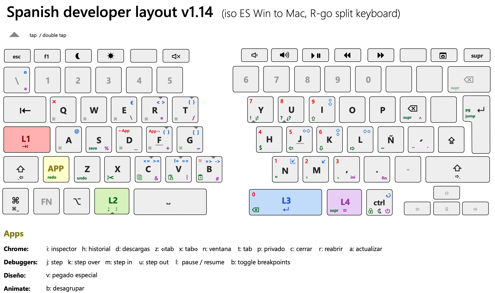

# Spanish developer layout ( Karabiner + Goku )
#### ISO ES Win to Mac, for split keyboards (based on [R-go Split](https://www.r-go-tools.com/products/ergonomic-keyboards/r-go-split/) )
[🇬🇧 Brief description](#Description)   [🇪🇸 Descripción en castellano](#Descripción)

## Description
A repetitive strain injury (RSI) is an injury to part of the musculoskeletal or nervous system caused by repetitive use, vibrations, compression or long periods in a fixed position. This keyboard layout has been designed to minimize postural problems associated with the placement of certain keys and symbols commonly used by software developers. To achieve this, it has been attempted to reduce the useful area of the keyboard to the minimum, placing the symbols in positions close to the strongest fingers (such as thumb and index fingers).

The following concepts have been used to put the concept into practice:

- Usage of a [split keyboard](https://www.r-go-tools.com/products/ergonomic-keyboards/r-go-split/) to improve the separation between both hands, placing them parallel to the shoulders. At the same time this makes it possible to use the space bar as two different keys.

- Extensive use of modifier keys (L1, L2, L3, L4 and a contextual modifier: the App layer). These modifiers allow you to stack different symbols on the same key.

- Usage of double keystrokes to write associated or alternative symbols.

- Usage of a contextual modifier: App Layer, which allows some keys to have specific behaviors in each program, something very useful for personalized keyboard shortcuts.

- Usage of textured keycaps in the modifiers to facilitate their location by touch

- Optimized for the Spanish language

- Usage of a visual layout as a mnemonic aid

## Descripción
https://www.ergodox.io
[Tenting](https://github.com/adereth/ergodox-tent)

