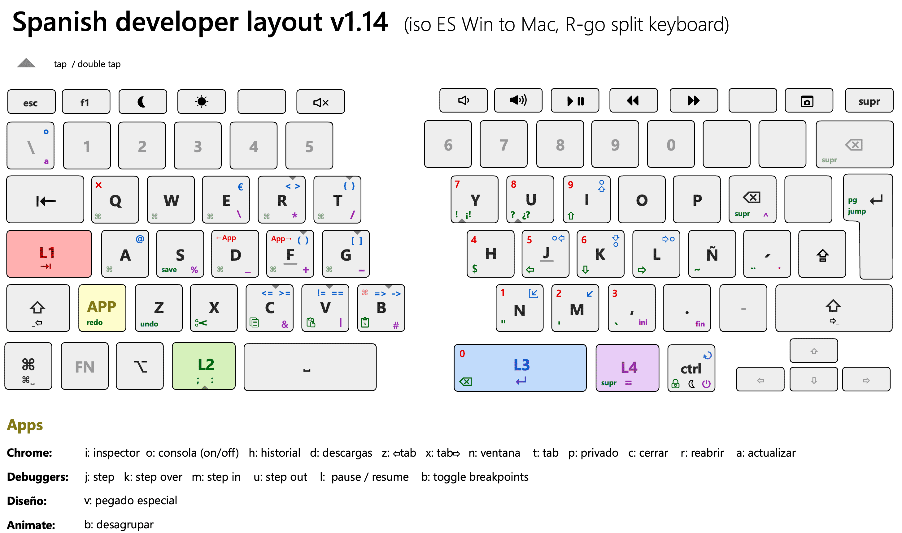

# Spanish developer layout for split keyboards (RSI friendly) 
### ISO ES Win to Mac, based on [R-go Split](https://www.r-go-tools.com/products/ergonomic-keyboards/r-go-split/) (Karabiner + Goku) 
[🇬🇧 Description](#-description)    [🇪🇸 Descripción](#-descripción)    [⬇️ Descarga](#%EF%B8%8F-descarga)

## 🇬🇧 Description

A repetitive strain injury (RSI) is an injury to part of the musculoskeletal or nervous system caused by repetitive use, vibrations, compression or long periods in a fixed position. This keyboard layout has been designed to minimize postural problems associated with the placement of certain keys and symbols commonly used by software developers. To achieve this, it has been attempted to reduce the useful area of the keyboard to the minimum, placing symbols in positions close to the strongest fingers (such as thumb and index fingers).

The following concepts have been used to put it into practice:

- Usage of a [split keyboard](https://www.r-go-tools.com/products/ergonomic-keyboards/r-go-split/) to improve the separation between both hands, placing them parallel to the shoulders. At the same time this makes it possible to use the space bar as two different keys.

- Extensive use of modifier keys (L1, L2, L3, L4 and a contextual modifier: the App layer). These modifiers allow you to stack different symbols on the same key.

- Usage of double keystrokes to write complementary or alternative symbols (marked with a triangle ▲) 

- Usage of a contextual modifier: App Layer, which allows some keys to have specific behaviors in each program, something very useful for personalized per-app keyboard shortcuts.

- Usage of textured keycaps in the modifiers to facilitate their location by touch

- Optimized for the Spanish language

- Usage of a visual layout as a mnemonic aid

## 🇪🇸 Descripción

Esta distribución de teclado ha sido diseñada para minimizar los problemas posturales asociados con la ubicación de ciertas teclas y símbolos comúnmente utilizados por los desarrolladores de software. Para lograrlo, se ha intentado reducir al mínimo el área útil del teclado, colocando los símbolos en posiciones cercanas a los dedos más fuertes (como los dedos pulgar e índice).

Los siguientes conceptos se han utilizado para ponerlo en práctica:

- Utilización de un [teclado dividido](https://www.r-go-tools.com/products/ergonomic-keyboards/r-go-split/qwerty-es-black-wired/) para mejorar la separación entre ambas manos, permitiendo su colocación paralela con respecto a los hombros. Al mismo tiempo, esto permite utilizar la barra espaciadora como dos teclas diferentes.

- Uso extensivo de teclas modificadoras (L1, L2, L3, L4 y un modificador contextual: la capa de la aplicación). Estos modificadores permiten apilar diferentes símbolos en una misma tecla.

- Uso de pulsaciones dobles para escribir símbolos complementarios o alternativos (marcados con ▲)

- Uso de un modificador contextual: la capa de aplicación, que permite que algunas teclas tengan comportamientos específicos en cada programa, algo muy útil para atajos de teclado personalizados.

- Uso de teclas con textura en los modificadores para facilitar su ubicación táctil

- Optimizado para el idioma español

- Uso de un mapa visual como ayuda mnemotécnica

## ⬇️ Descarga

Para utilizar esta distribución de teclado es necesario utilizar [Karabiner](https://karabiner-elements.pqrs.org/), (únicamente compatible con macOS). La configuración actual está ideada para un teclado [R-Go Split](https://www.r-go-tools.com/products/ergonomic-keyboards/r-go-split/qwerty-es-black-wired/) en distribución ISO ES, pero si te interesa puedes adaptarla a otros teclados adaptando el "devices" del código fuente. También tendrás que adaptar los identificadores de "location_id" correspondientes a la parte izquierda y derecha de tu teclado, los cuales podrás averiguar utilizando la herramienta EventViewer incluida en Karabiner. 

- [**Descargar configuración para Karabiner**](karabiner.json). Ubicar el archivo en /Users/tu_usuario/.config/karabiner
- [**Descargar código fuente**](karabiner.edn) (en sintaxis [Goku](https://github.com/yqrashawn/GokuRakuJoudo)). Ubicar el archivo en /Users/tu_usuario/.config/   y utilizar el comando goku para transpilarlo a un archivo de configuración válido

